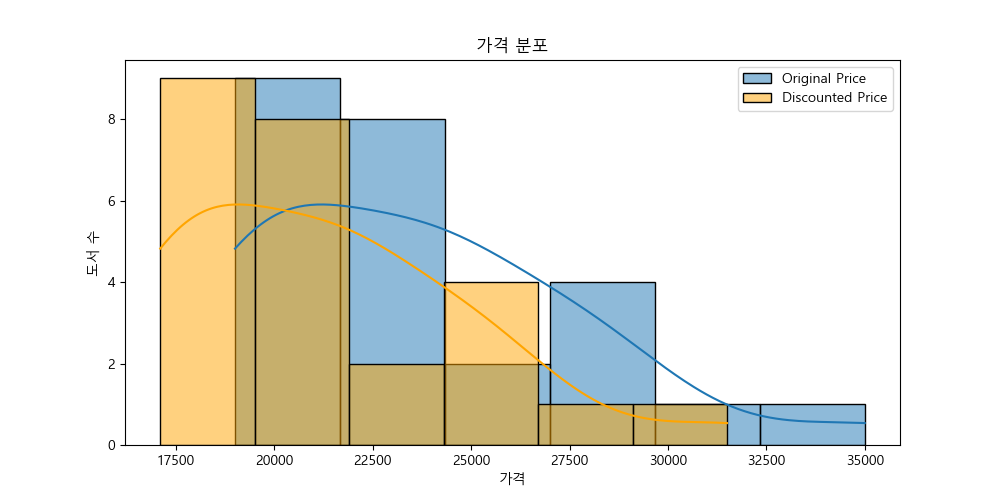
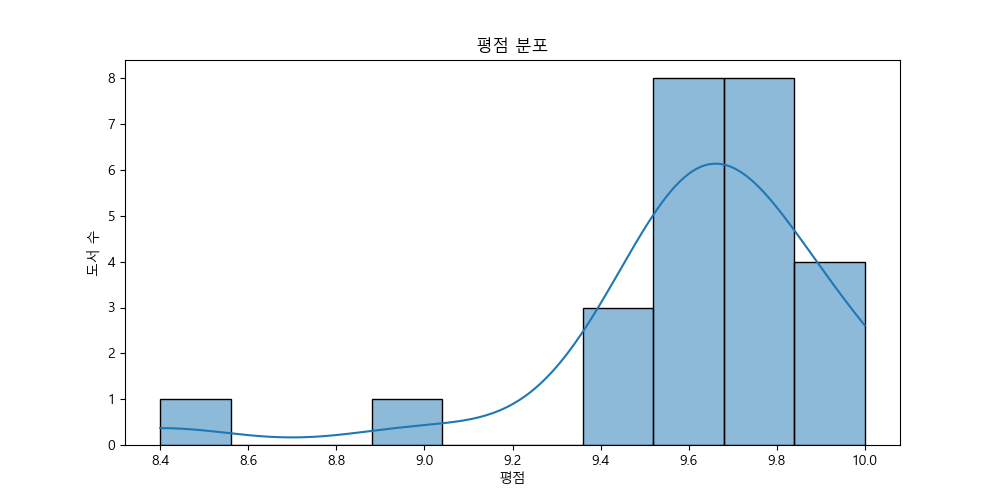
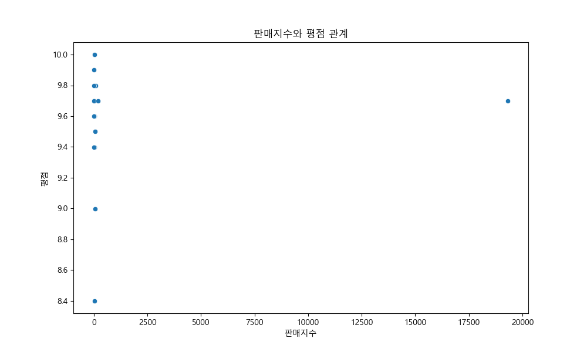
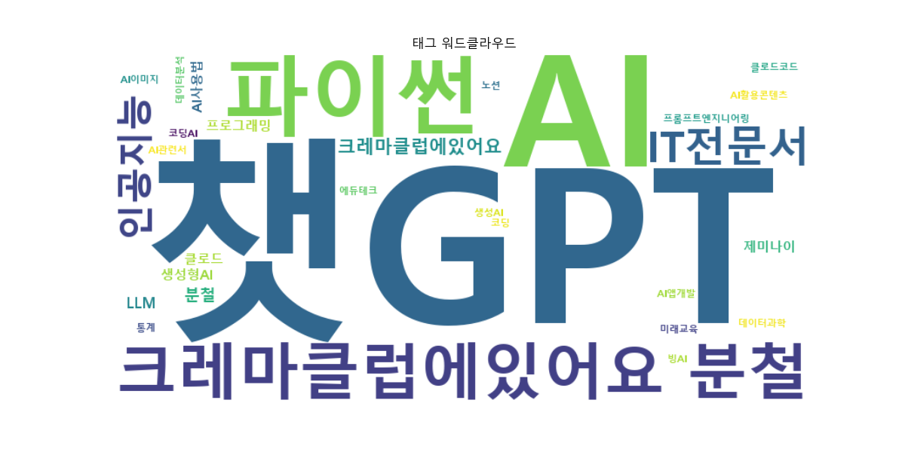

# YES24 AI 도서 데이터 분석

## 1. 데이터 개요

### 데이터 일부

아래는 `yes24_ai.csv` 파일의 첫 5행을 보여줍니다.

| Title | Book_URL | Author | Publisher | Publication_Date | Original_Price | Discounted_Price | Sales_Index | Review_Count | Rating | Tags | Image_URL |
| :-------------------------------------- | :--------------------------------------------------------------------------------------------------------------------- | :------- | :---------- | :--------------- | :------------- | :--------------- | :---------- | :----------- | :----- | :-------------------------------------- | :---------------------------------------- |
| 된다! 하루 만에 끝내는 제미나이 활용법 | https://www.yes24.com/product/goods/163301895 | 권서림 | 이지스퍼블리싱 | 2025년 11월 | 20000 | 18000 | 92 | 62 | 9.8 | #분철, #AI, #AI사용법, #AI이미지, #AI활용콘텐츠 | https://image.yes24.com/goods/163301895/L |
| 요즘 바이브 코딩 안티그래비티 완벽 가이드 | https://www.yes24.com/product/goods/174658020 | 최지호 | 골든래빗 | 2026년 02월 | 28000 | 25200 | 26 | 2 | 10.0 | #분철 | https://image.yes24.com/goods/174658020/L |
| 누구나 아는 나만 모르는 제미나이 | https://www.yes24.com/product/goods/172517063 | 이성원 | 한빛미디어 | 2026년 01월 | 19000 | 17100 | 26 | 11 | 10.0 | #제미나이, #AI, #AI관련서, #생성형AI, #AI사용법 | https://image.yes24.com/goods/172517063/L |
| AI 시대의 질문력, 프롬프트 엔지니어링 | https://www.yes24.com/product/goods/150566390 | 류한석 | 코리아닷컴(Korea.com) | 2025년 08월 | 27000 | 24300 | 59 | 44 | 9.5 | #분철, #클로드, #제미나이, #생성형AI, #챗GPT | https://image.yes24.com/goods/150566390/L |
| 요즘 교사를 위한 에듀테크 5대장 : 캔바, 패들렛, 북크리에이터, 노션, 챗GPT∙제미나이 | https://www.yes24.com/product/goods/169849422 | 안익재 | 앤써북 | 2025년 12월 | 19800 | 17820 | 17 | 84 | 10.0 | | https://image.yes24.com/goods/169849422/L |

### 데이터 정보

총 12개의 컬럼과 25개의 행으로 구성되어 있습니다. 각 컬럼의 데이터 타입과 결측치 여부는 다음과 같습니다.

```
<class 'pandas.core.frame.DataFrame'>
RangeIndex: 25 entries, 0 to 24
Data columns (total 12 columns):
 #   Column            Non-Null Count  Dtype  
---  ------            --------------  -----  
 0   Title             25 non-null     object 
 1   Book_URL          25 non-null     object 
 2   Author            25 non-null     object 
 3   Publisher         25 non-null     object 
 4   Publication_Date  25 non-null     object 
 5   Original_Price    25 non-null     int64  
 6   Discounted_Price  25 non-null     int64  
 7   Sales_Index       25 non-null     int64  
 8   Review_Count      25 non-null     int64  
 9   Rating            25 non-null     float64
 10  Tags              23 non-null     object 
 11  Image_URL         25 non-null     object 
dtypes: float64(1), int64(4), object(7)
memory usage: 2.5+ KB
```

`Tags` 컬럼에 2개의 결측치가 존재하며, `Original_Price`, `Discounted_Price`, `Sales_Index`, `Review_Count`, `Rating` 컬럼은 수치형 데이터로 구성되어 있습니다.

### 기초 통계

```
             Original_Price  Discounted_Price    Sales_Index  Review_Count     Rating
count             25.000000         25.000000      25.000000     25.000000  25.000000
mean           23512.000000      21160.800000     836.280000     38.600000   9.608000
std             4312.086389       3880.877750    3816.634626     27.876404   0.457859
min            19000.000000      17100.000000       6.000000      2.000000   8.400000
25%            20000.000000      18000.000000      10.000000     22.000000   9.600000
50%            24000.000000      21600.000000      26.000000     31.000000   9.700000
75%            27000.000000      24300.000000      60.000000     45.000000   9.800000
max            35000.000000      31500.000000   19311.000000     97.000000  10.000000
```

## 2. 데이터 시각화

### 가격 분포

원본 가격과 할인된 가격의 분포를 보여주는 히스토그램입니다. 대부분의 도서가 20,000원에서 25,000원 사이에 분포하고 있음을 확인할 수 있습니다.



### 출판사별 도서 수

각 출판사별로 출간된 도서의 수를 보여주는 막대 그래프입니다. '이지스퍼블리싱'이 가장 많은 AI 관련 도서를 출판했음을 알 수 있습니다.


### 평점 분포

도서 평점의 분포를 나타내는 히스토그램입니다. 대부분의 도서가 높은 평점을 유지하고 있으며, 9.5점 이상의 도서가 많습니다.



### 판매지수와 평점 관계

판매지수와 평점 간의 관계를 보여주는 산점도입니다. 판매지수가 높은 도서가 반드시 평점도 높지는 않으며, 두 지표 간에 강한 선형 관계는 보이지 않습니다.



### 태그 워드클라우드

도서 태그를 분석하여 워드클라우드 형태로 시각화한 것입니다. '챗GPT', 'AI', '파이썬', '인공지능'과 같은 키워드가 자주 등장함을 알 수 있습니다.


